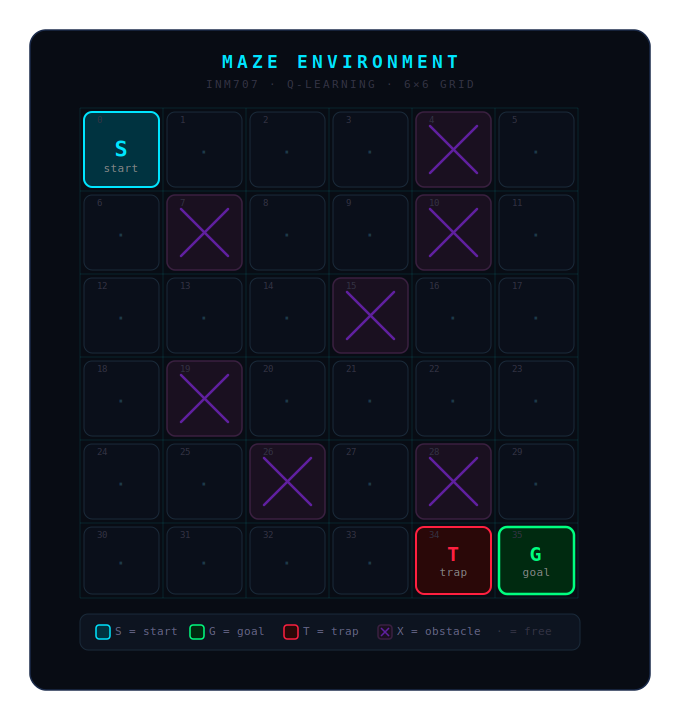
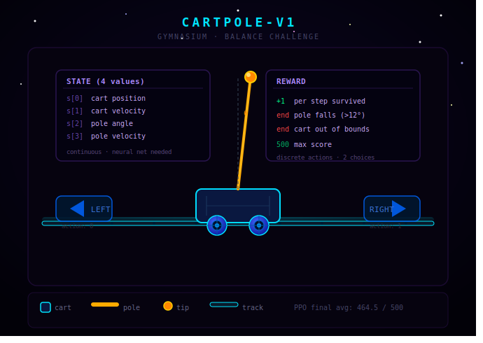

# INM707 Deep Reinforcement Learning Coursework


## Project Overview

Implementation and evaluation of Reinforcement Learning algorithms including Q-Learning, Deep Q-Network (DQN), and Proximal Policy Optimization (PPO).

**Course:** INM707 Deep Reinforcement Learning

**Institution:** City St George's, University of London

**Author:** Bo Fu

---

## Environment Visualizations

### Maze Environment (Basic Part)
<p align="center">
  
</p>
<p align="center">
  <em>6x6 maze environment with start, goal, trap and obstacles</em>
</p>

### CartPole-v1 (Advanced Part)
<p align="center">
  
</p>
<p align="center">
  <em>CartPole-v1 environment with 4 continuous state values and 2 discrete actions</em>
</p>


---

## Algorithms Implemented

### Basic Part
- **Q-Learning** on a custom 6x6 maze environment

### Advanced Part
- **Basic DQN** on CartPole-v1
- **DQN + Experience Replay** on CartPole-v1
- **DQN + Experience Replay + Target Network** on CartPole-v1
- **PPO (Proximal Policy Optimization)** on CartPole-v1

---

## Results Summary

| Algorithm | Environment | Final Avg Score |
|-----------|-------------|----------------|
| Q-Learning | 6x6 Maze | 100% success rate |
| Basic DQN | CartPole-v1 | 138.7 |
| DQN + Experience Replay | CartPole-v1 | 430.8 |
| DQN + ER + Target Network | CartPole-v1 | 123.5 |
| PPO | CartPole-v1 | 464.5 / 500 |

---

## Project Structure

```bash
INM707-FU/
├── INM707-FU.ipynb    # main notebook (all tasks)
├── image/             # saved figures
└── README.md
```

---

## Setup

```bash
pip install numpy torch gymnasium matplotlib
```

---

## How to Run

Open and run `INM707-FU.ipynb` in Jupyter Notebook or JupyterLab from top to bottom.

The notebook is structured according to the coursework grading scheme:

- **Task 1-4**: Q-Learning on 6x6 maze (environment, reward function, training)
- **Task 5-6**: Parameter experiments (alpha, gamma, policy comparison)
- **Task 7-8**: DQN with Experience Replay and Target Network (CartPole-v1)
- **Task 9-10**: PPO (CartPole-v1)

---

## Requirements

- Python 3.x
- PyTorch
- Gymnasium
- NumPy
- Matplotlib

---

## Reproducibility

Random seed fixed at 42 for all experiments.

---

## Summary

This coursework demonstrates the implementation and comparison of three reinforcement learning approaches. Q-Learning solves the discrete maze environment achieving 100% success rate. DQN extends Q-Learning to continuous state spaces using neural networks, with Experience Replay and Target Network as improvements. PPO achieves the best performance on CartPole-v1 with a final average score of 464.5 out of a maximum of 500.
